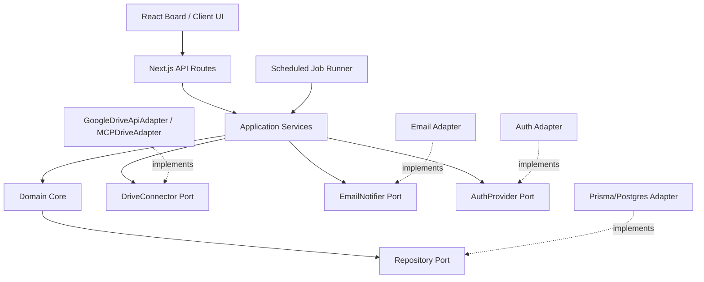
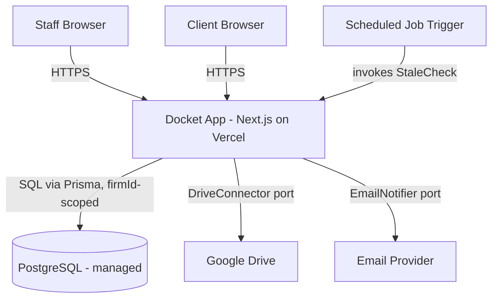
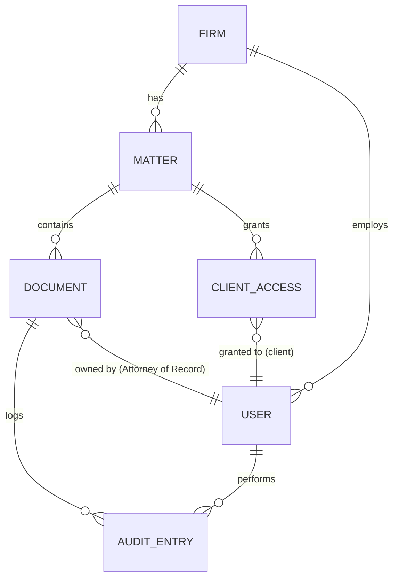

# Architecture Spine — Docket

## Design Paradigm

Hexagonal (ports & adapters). Chosen specifically because the Google Drive integration mechanism was left open for architecture to resolve (custom API client vs. an MCP driver) — a port boundary turns that into a swappable adapter detail instead of a structural fork that ripples through the codebase. `[ASSUMPTION]` no paradigm was specified upstream.

- **Domain core** (`domain/`) — Firm, Matter, Document, AuditEntry, Status rules. No outward dependencies.
- **Application services** (`application/`) — orchestrate domain + ports: StatusTransition, DelegatedApproval, MatterOnboarding, StaleCheck.
- **Ports** (`ports/`) — interfaces the domain/application layer depends on: `DriveConnector`, `EmailNotifier`, `AuthProvider`.
- **Driven adapters** (`adapters/`) — implement the ports: `GoogleDriveApiAdapter` | `MCPDriveAdapter` (Deferred choice), email adapter, auth adapter, Prisma/Postgres repository adapter.
- **Driving adapters** (`app/`) — Next.js API routes, board/client UI, scheduled job runner — call into application services, never into adapters or the DB directly.



## Invariants & Rules

### AD-1 — Firm-scoped data isolation is structural, not conventional

- **Binds:** FR-16, NFR-2, all epics
- **Prevents:** a query or migration forgetting the Firm filter and leaking one Firm's data to another
- **Rule:** every domain entity carries `firmId`. All reads/writes go through a repository layer that requires and applies a `firmId` filter by construction (e.g. a Prisma Client extension that rejects any query missing it) — no route handler or service may query the database directly, and no repository method may accept an "unscoped" mode. Raw SQL (`$queryRaw`/`$executeRaw`) is banned outside the repository adapter itself — a Client extension alone doesn't stop a bypass, so the ban is the enforceable half of this Rule.

### AD-2 — Drive access is isolated behind one port

- **Binds:** FR-1, FR-2, FR-3, FR-14 (Epics 1, 6)
- **Prevents:** Drive-specific concerns (OAuth token refresh, file listing, polling) scattering across services, making the custom-API-vs-MCP-driver choice a rewrite instead of a swap; and a second, incompatible file-reference shape appearing for scanned documents
- **Rule:** all Google Drive interaction goes through the `DriveConnector` port (`connect`, `listNewFiles`, `getFileMetadata`, `resolveLink`, `uploadFile`). Application services and domain code depend only on this interface — never on a concrete Drive SDK or MCP client type. A Scanned Document's file (FR-14, Story 6.1) is uploaded through the same port's `uploadFile` into the Matter's Drive folder — it is not a second storage path; a `Document`'s file reference always has one shape regardless of whether it arrived by auto-detection or manual scan-log, and `uploadFile` is optional at call time (Story 6.1's "attach later"). The concrete adapter is Deferred (see below).

### AD-3 — Status transitions have one owner

- **Binds:** FR-4, FR-5, FR-9 (Epics 2, 4)
- **Prevents:** transition/validation logic (the Reviewed-by requirement, the warn-not-block rule on Filed/Sent) being reimplemented differently in the board UI, the delegated-approval path, and the API, and drifting apart; and a second, mutable cache of a transition-derived fact (e.g. a `reviewedByUserId` column) quietly reopening the drift AD-6 exists to prevent
- **Rule:** every Status change — board drag, Move-to-Status menu, or Delegated Approval — calls the single `StatusTransition` application service; `DelegatedApproval` (Epic 4) calls `StatusTransition` internally rather than mutating `Document` independently, passing its actor/reason through to the same transaction. No code path writes `Document.status` directly. `Document` may carry denormalized, transition-derived display fields for the board/card (`reviewedByUserId`, `statusChangedAt` per AD-7) — but `StatusTransition` is their only writer, always in the same transaction as the matching `AuditEntry` (AD-6). Any other code path reading or writing one of these fields, or a UI needing history beyond the current value, goes through `AuditEntry` — never a second cache.

### AD-4 — Blocked is computed, never stored

- **Binds:** FR-4, EXPERIENCE.md Blocked-badge spec (Epic 2)
- **Prevents:** a persisted `blocked` field drifting out of sync with `status`
- **Rule:** `Blocked` is a derived value (`true` iff `status == WAITING_ON_CLIENT_SIGNATURE`), computed at read time in the domain layer. No migration may add a `blocked` column, and no API response may accept `blocked` as writable input.

### AD-5 — Client access shares the staff authorization layer, at both row and field level

- **Binds:** FR-11, FR-12, FR-13 (Epic 5)
- **Prevents:** a parallel client-only backend or API surface accumulating its own, differently-shaped security bugs; and staff-only fields (Reviewed-by attribution) leaking into a client response because "it's the same Document Card" was read as "it's the same payload"
- **Rule:** Client and staff requests are authorized through the same `AuthProvider` port and the same repository-level `firmId` check (AD-1). Two distinct narrowings apply on top, both required: **row-level** — a Client only reaches Matters/Documents covered by an active `ClientAccess` grant; **field-level** — every client-scoped response is built through one dedicated serializer that includes Status, Deadline, Owner, Aging, Blocked and omits Reviewed-by and any other staff-only field (per EXPERIENCE.md's Client Matter View spec). No route may return the internal `Document` shape directly to a Client-role request.

### AD-6 — Delegated Approval, Reviewed-by, and reassignment are immutable audit events

- **Binds:** FR-5, FR-9, FR-10, Story 1.5 (Epics 1, 2, 4)
- **Prevents:** an audit trail reconstructed after the fact from mutable `Document` fields, which is unreliable once a record can be edited again
- **Rule:** these three actions each append an `AuditEntry` row (`documentId`, `matterId`, `actor`, `timestamp`, `action type`, optional `reason`) in the same transaction as the `Document` mutation — `documentId`/`matterId` are required fields, not optional, since FR-10 requires the audit trail to identify what it applied to. `AuditEntry` rows are insert-only — no update or delete path exists for them.

### AD-7 — One Aging computation, used everywhere

- **Binds:** FR-7, FR-8, NFR-1 (Epic 3)
- **Prevents:** the live board's Aging Rail and the emailed Stale Alert disagreeing about what counts as stale, because each computed "days since last change" independently
- **Rule:** `Document` carries a single `statusChangedAt` timestamp, written only by `StatusTransition` (AD-3), in the same transaction as the status change. `Aging = now - statusChangedAt` is one domain function; both the board render and the scheduled Stale Alert job call it — neither recomputes Aging independently, and neither derives it by scanning `AuditEntry` history (which is append-only and not indexed for this).

### AD-8 — Adapter secrets are encrypted at rest and excluded from logs

- **Binds:** `DriveConnector` adapter (AD-2), any future adapter holding a credential
- **Prevents:** a Drive OAuth refresh token (or any adapter secret) landing in Postgres as plaintext, or being written to structured logs during debugging
- **Rule:** OAuth tokens and comparable adapter secrets are encrypted at rest (application-level encryption before the Prisma write, not reliance on disk/volume encryption alone) and are excluded by name from the structured-logging convention — a shared redaction list, not per-call-site discipline.

## Consistency Conventions

| Concern | Convention |
| --- | --- |
| Naming (entities, files, interfaces, events) | Entities PascalCase singular (`Firm`, `Matter`, `Document`, `ClientAccess`, `AuditEntry`, `User`). API routes plural kebab (`/api/matters`, `/api/documents/:id`). Ports named `{Noun}Connector` / `{Noun}Notifier` / `{Noun}Provider`; adapters named `{Vendor}{Port}Adapter`. |
| Data & formats (ids, dates, error shapes, envelopes) | IDs: UUIDv4, generated application-side (not DB `serial`). Dates: ISO-8601 UTC everywhere, including `Deadline` and `AuditEntry.timestamp`. Errors: `{ error: { code, message } }` envelope on every API response. Aging: always server-computed integer days, never derived client-side. |
| State & cross-cutting (mutation, errors, logging, config, auth) | Every domain mutation goes through an Application Service method — no route handler writes to the repository directly, so AD-1 (firm scoping) and AD-6 (audit logging) can't be bypassed. Auth: session carries `{ userId, firmId, role }`; every request resolves these before touching a repository. Logging: structured JSON with a request id. Config: environment variables only, no secrets committed to the repo. |

## Stack

| Name | Version |
| --- | --- |
| Node.js | 24 (active LTS as of Aug 2026) |
| TypeScript | 6.x (the stable line prior to 7.0) `[ASSUMPTION]` — TS 7.0.2 (native Go compiler, ~10x faster builds) shipped July 28, 2026, days before this spine; deliberately not pinning it yet — a brand-new compiler rewrite is exactly the kind of bleeding edge a small team with no dedicated tooling owner shouldn't absorb first. Revisit once the Next.js/ESLint/ts-node ecosystem has caught up. |
| Next.js | 16.2.x (16.2.12 is current patch, July 2026) |
| PostgreSQL | 18.x (current stable, mid-2026) |
| Prisma ORM | 7.9.x (7.9.1 current, Aug 2026) |
| Tailwind CSS | 4.3.x (current stable, July 2026) |

All verified current at authoring via web search, not asserted from training data (the TypeScript row was corrected during the reviewer gate — the first pass asserted "5.x" without checking; re-verified against npm/Microsoft DevBlogs before finalizing). None of this list is user-specified — every row is `[ASSUMPTION]`, chosen as a well-known, currently-maintained, mutually-compatible greenfield stack for a small internal tool with no existing codebase or team stack preference on record. No alternative ORM (e.g. Drizzle) was comparison-shopped against Prisma; Prisma was picked directly for its firm-scoping-middleware fit (AD-1) — acceptable for this stakes level, but named here rather than silently passed over.

## Structural Seed





**Deployment & environments:** dev / staging / prod. The Next.js app deploys to Vercel (pairs natively with the framework, zero-config CI/CD — a fit for a team with no dedicated ops). `[ASSUMPTION]` Database hosting provider is Deferred (see below); the shape is fixed — managed Postgres, single primary region, not self-hosted — for a 12-person single-firm launch with no stated multi-region or data-residency requirement. Logs ship to the hosting platform's default sink (Vercel's log stream) for v1 — no dedicated log-aggregation service is in scope; revisit only if log retention beyond the platform's default becomes a real need. The scheduled `StaleCheck` job's execution is itself monitored (a missed run is a silent NFR-1 violation) — concrete alerting tool is Deferred, but the requirement to have one is not optional at launch.

```text
docket/
  app/                  # Next.js routes -- driving adapter (HTTP + UI)
    api/                 # API route handlers
    (board)/             # Workflow Board + Document Detail UI
    (client)/            # Client Matter View UI
  application/          # StatusTransition, DelegatedApproval, MatterOnboarding, StaleCheck
  domain/                # Firm, Matter, Document, AuditEntry, Status rules -- no outward deps
  ports/                 # DriveConnector, EmailNotifier, AuthProvider interfaces
  adapters/
    drive/                 # GoogleDriveApiAdapter | MCPDriveAdapter (Deferred choice, AD-2)
    email/                  # Email adapter
    auth/                   # Auth adapter
    db/                      # Prisma repository adapter, firmId-scoped by construction (AD-1)
  jobs/                  # Scheduled job runner (StaleCheck trigger)
  prisma/                # schema.prisma, migrations
```

## Deferred

- **Concrete `DriveConnector` adapter** (custom Google Drive API client vs. MCP-driver-backed) — the user explicitly deferred this to architecture; AD-2 resolves the *structural* half (isolate behind a port, and route scan-file uploads through it too) but not the concrete pick. Recommend a short implementation-time spike during Story 1.2 comparing OAuth/token-refresh handling and rate-limit behavior between the two before committing.
- **Concrete `AuthProvider` adapter** — no session/identity provider named (roll-your-own vs. an auth-as-a-service provider). Same treatment as Drive: isolated behind a port (Design Paradigm), concrete pick open. A 12-person single-firm tool doesn't need this resolved before Epic 1 starts, but it blocks Epic 5 (Client Access) and should be picked before then.
- **Concrete `EmailNotifier` adapter** — no transactional email provider named for the Stale Alert (FR-8). Needed before Epic 3.
- **New-document detection mechanism and polling cadence for FR-2** (Story 1.3) — PRD Open Question 2 and epics.md both flag this unresolved; AD-2 fixes where Drive access lives, not how often `listNewFiles` is invoked or by what trigger (polling interval vs. Drive push notifications/webhooks).
- **Managed Postgres hosting provider and backup/DR policy** — depends on the firm's existing cloud/IT relationships, which this run has no information about. Whatever's chosen must support automated backups with point-in-time recovery; that requirement is fixed even though the provider isn't.
- **Firm-provisioning process/tool** (PRD Open Question 5) — how a second Firm would actually get created. Not needed for the single-Firm v1 launch; AD-1 makes the schema ready whenever it's answered.
- **Notification channel beyond email** — explicit PRD non-goal for v1 (§6.2).
- **Client comment/question channel** (PRD Open Question 3) — unresolved; EXPERIENCE.md treats the Client Matter View as strictly non-interactive until answered, so no port or endpoint exists for it yet.
- **Behavior on a Drive file deleted or moved out of its watched folder** (PRD Open Question 4) — EXPERIENCE.md specifies the UX default (inactive Drive-link state, record persists); whether that needs a background reconciliation job or is purely lazy (checked on next access) is not yet decided.
- **Exact scheduled-job mechanism** (cron package, external trigger, queue) — any implementation satisfies AD-7 as long as it calls the shared `StaleCheck` application service rather than recomputing Aging itself; its execution-monitoring tool (see Deployment & environments) is a separate open pick.
